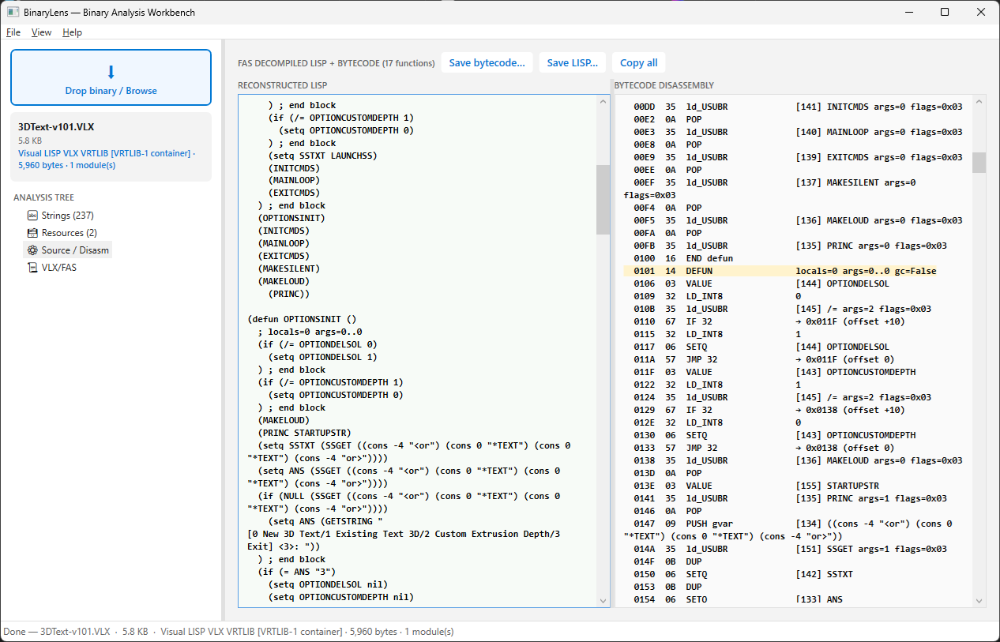

# BinaryLens

A Windows desktop tool for analyzing binary files. Drop in a PE executable, DLL, AutoCAD ARX/VLX/FAS, VB5/6 OCX/EXE, or Python .pyc/.pyd and get a structured breakdown of everything inside: headers, imports, exports, strings, resources, disassembly, and decompiled source.

Built with .NET 9, WPF, and C#. Single-window, tree-navigated UI — no tab strip clutter.



## Supported Formats

- **PE files** (EXE, DLL, SYS, OCX) — headers, sections, imports, exports, resources, entropy
- **AutoCAD ARX** — entry point detection, ObjectARX class identification, SDK version inference
- **AutoCAD VLX/FAS** — full bytecode disassembly and best-effort LISP decompilation with symbol resolution, while-loop detection, command merging, and ADS-to-LISP name translation
- **VB5/6 executables** — VB header parsing, object table extraction, control and method enumeration, .frm/.bas/.cls export
- **Python .pyc** — magic number identification, bytecode decoding across Python versions
- **Python .pyd** — native extension DLL analysis
- **.NET assemblies** — decompiled to C# source via ILSpy engine
- **Native x86/x64** — disassembly via Capstone engine

## Analysis Panels

| Panel | Description |
|-------|-------------|
| PE Structure | Headers, section table, entropy per section, PE characteristics |
| Imports | Every imported DLL and function with live-filter search |
| Exports | All exported symbols with RVA and ordinal |
| Strings | ASCII and UTF-16 printable strings with offset and encoding filter |
| Resources | Type, name, language, size for every embedded resource |
| Dependencies | Recursive DLL dependency tree, color-coded by status |
| Source / Disasm | .NET → decompiled C#; native → x86/x64 disassembly |
| ARX Details | AutoCAD ARX detection, ObjectARX classes, SDK version |
| VLX/FAS Details | Module list, bytecode disassembly, reconstructed LISP source |
| VB5/6 Details | Object table, controls, methods, exportable .frm/.bas stubs |

## Export Formats

- HTML report (standalone, self-contained)
- JSON data export
- CSV table export
- LISP source files (single or batch multi-module)
- VB form/module stubs (.frm, .bas, .cls)
- Comparison report (diff two binaries)

## Build

Requires the .NET 9 SDK on Windows (x64).

```
dotnet restore
dotnet build -c Release -r win-x64
```

Or use the included `build.bat` for a release build plus self-contained publish.

To produce a single-file executable:

```
dotnet publish -c Release -r win-x64 --self-contained true -p:PublishSingleFile=true
```

## NuGet Dependencies

| Package | Version | Purpose |
|---------|---------|---------|
| [PeNet](https://github.com/secana/PeNet) | 4.0.0 | PE header parsing, imports, exports, resources |
| [ICSharpCode.Decompiler](https://github.com/icsharpcode/ILSpy) | 8.2.0.7535 | .NET assembly decompilation to C# |
| [Gee.External.Capstone](https://github.com/9ee1/Capstone.NET) | 2.3.0 | Native x86/x64 disassembly via Capstone engine |

## Project Structure

```
BinaryLens/
├── MainWindow.xaml / .xaml.cs   UI shell — single window, tree-navigated
├── App.xaml / .xaml.cs          Theme, styles, colors
├── Analysis/
│   ├── BinaryAnalyzer.cs        Multi-pass analysis orchestrator
│   ├── PeAnalyzer.cs            PE headers, sections, imports, exports, resources
│   ├── StringExtractor.cs       ASCII + UTF-16 string extraction
│   ├── ArxAnalyzer.cs           AutoCAD ARX detection
│   ├── VlxAnalyzer.cs           VLX/FAS bytecode disassembler and LISP decompiler
│   ├── VbAnalyzer.cs            VB5/6 header parsing, object table, controls
│   ├── PycAnalyzer.cs           Python .pyc detection and version ID
│   ├── PycDecoder.cs            Python bytecode decoder (multi-version)
│   ├── PydAnalyzer.cs           Python .pyd native extension analysis
│   ├── CodeAnalyzer.cs          .NET decompile + native disassembly dispatch
│   └── DependencyAnalyzer.cs    Recursive DLL dependency tree
├── Models/
│   └── AnalysisResult.cs        All data model classes
├── Export/
│   ├── HtmlReporter.cs          Standalone HTML report
│   ├── JsonExporter.cs          JSON export
│   ├── CsvExporter.cs           CSV table export
│   └── ComparisonReporter.cs    Binary diff report
└── build.bat
```

## Acknowledgments

The VLX/FAS decompiler was built with significant help from several open-source reference projects that document the FAS bytecode format. These projects were studied for opcode definitions, stream architecture, and decryption approaches:

- **Fas-Disasm** by cw2k — VB6 FAS/FSL disassembler (versions 0.4–0.11, 2005–2018). Primary reference for opcode tables, two-stream architecture (resource + function streams), and the FAS file format. Includes the only known public [FAS format specification](http://files.planet-dl.org/cw2k/Fas%20AutoLisp-Decompiler/fas-format.htm). [GitHub](https://github.com/cw2k/Fas-Disasm)
- **FAS-Decompiler** — C#/WPF FAS decompiler covering FAS2/3/4 signature detection and stack-based decryption
- **fasd** (v0.59) — FAS disassembler, referenced for opcode behavior
- **UnLISP** (v2.1) — AutoCAD LSP decryptor
- **FSL-DeCrypt** (v0.9.28) — FSL file decryption reference
- **VLX2FAS** (v1.1) — VLX-to-FAS converter, referenced for VLX container structure
- **vllib.dll analysis** — Autodesk VisualLISP runtime, studied for internal opcode semantics

The VB5/6 analyzer was informed by:

- **exdec** by josephCo/MEX/C4N — VB P-Code disassembler
- **VBDE** (v0.85) by iorior — VB6 decompiler/source recovery tool
- Additional VB5/6 binary format references (vb56b1–b4, vb6idc)
- Gen Digital's research on [binary data hiding in VB6 executables](https://www.gendigital.com/blog/insights/research/binary-data-hiding-in-vb6-executables)

## License

MIT
